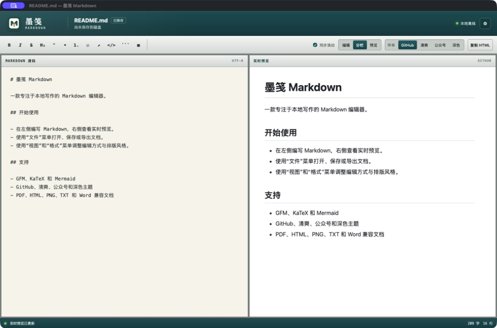

# InkMark Markdown

[简体中文](README.md) · [Download Latest Release](https://github.com/chmod740/inkmark/releases/latest) · [Report an Issue](https://github.com/chmod740/inkmark/issues)

InkMark is a local Markdown editor for macOS and Windows with live preview, native menus, multiple reading themes, and complete document export. Everything required for editing, rendering, and exporting ships with the app; a network connection is used only when you explicitly check for updates or open an external link.



## Highlights

- Open, edit, save, and save-as for `.md` and `.markdown` files
- Debounced 120 ms live rendering with editor-only, split, and preview-only layouts
- Stable two-way scroll synchronization between the editor and preview
- GitHub, Clean, WeChat, and Dark preview themes
- Native macOS and Windows menus for files, editing, views, formatting, help, and updates
- Automatic language detection plus explicit Simplified Chinese and English settings; automatic detection is the default
- A localized welcome page on normal launch; Finder or Explorer file launches open the requested document directly
- One consistent icon for the app, file associations, desktop shortcuts, and in-app branding
- An About page with version, author, source repository, and update status
- GitHub Releases update checks with platform-specific installer selection

## Markdown and Preview Support

- CommonMark and GitHub Flavored Markdown
- Tables, task lists, strikethrough, autolinks, and alerts
- Inline and display KaTeX formulas
- Mermaid flowcharts, sequence diagrams, and other diagrams
- Highlighting for JavaScript, TypeScript, Python, Go, Rust, JSON, Shell, and other common languages
- Sanitization of raw HTML, blocking scripts, iframes, objects, embeds, and raw SVG injection

## Export Formats

| Format | Description |
| --- | --- |
| PDF | Smart A4 pagination using the active theme |
| HTML | A complete UTF-8 page that may reference external styles, fonts, images, and media |
| PNG | A long image of the complete preview |
| TXT | Plain Markdown source text |
| Word-compatible document | UTF-8 HTML `.doc` with Office metadata that Microsoft Word can open and edit |

## Download and Install

Download the appropriate installer from [GitHub Releases](https://github.com/chmod740/inkmark/releases/latest):

- macOS 11 or later: `macos-universal.dmg`, supporting both Apple Silicon and Intel
- Windows 10/11 x64: `windows-amd64-setup.exe`

The macOS and Windows packages are not currently signed with commercial distribution certificates. Gatekeeper or SmartScreen may therefore show a warning on first launch. Confirm that the file came from this repository's Release page and verify it with the accompanying `SHA256SUMS` file.

## Quick Start

1. Launch InkMark directly, or open a Markdown file with InkMark from Finder or Explorer.
2. Edit on the left and inspect the live preview on the right.
3. Use the View menu for layouts and themes, and the Format menu for common Markdown markup.
4. Save from the File menu or export to PDF, HTML, PNG, TXT, or a Word-compatible document.
5. Choose Automatic, Simplified Chinese, or English in Settings.
6. Use Help → Check for Updates; the About page also reports update status.

## Offline and Network Behaviour

The editor never loads JavaScript, CSS, fonts, KaTeX, Mermaid, or highlighting assets from a CDN. Opening, editing, previewing, saving, and local exporting work offline.

Network access occurs only for user-requested actions:

- Checking GitHub Releases for a new version
- Downloading an update or opening the source repository on GitHub
- Opening an external link in a document
- Loading external resources referenced by an exported HTML file

## Build from Source

InkMark uses Go, [Wails v2](https://wails.io/), and Vue 3. Building requires Go 1.25+, Node.js, pnpm, and the native toolchain for the target platform.

macOS:

```bash
./scripts/build-macos.sh
./scripts/package-macos.sh
```

The scripts build a Universal app and create a DMG, ZIP, and checksum file under `dist/`.

Windows:

```powershell
powershell.exe -NoProfile -ExecutionPolicy Bypass -File .\scripts\build-windows.ps1
```

The Windows build requires NSIS and the WebView2 Runtime. It creates a per-user installer and registers `.md` and `.markdown` file associations.

## Tests

```bash
go test ./...
go test -race ./...
pnpm --dir frontend typecheck
pnpm --dir frontend test:i18n
pnpm --dir frontend test:export
pnpm --dir frontend test:scroll
pnpm --dir frontend test:installer
node scripts/verify-offline.mjs
```

The suite covers file I/O, language settings, native menus, version comparison and Release responses, export structure, external-resource policy, scroll synchronization, and offline asset integrity.

## Project Layout

- `app.go`: native dialogs, file I/O, and export saving
- `app_state.go`: language preferences, single-instance handling, and OS file-open events
- `update.go`: app metadata, GitHub Releases checks, and platform installer selection
- `menu.go`: native macOS and Windows menus
- `frontend/src/App.vue`: editor, live preview, Settings, and About
- `frontend/src/i18n.ts`: Chinese and English UI and welcome-page content
- `frontend/src/export-document.ts`: HTML, PDF, PNG, TXT, and Word-compatible exports
- `frontend/src/scroll-sync.ts`: stable bidirectional scroll synchronization
- `scripts/`: build, packaging, and regression-test scripts

## Versions and Updates

Releases use `vMAJOR.MINOR.PATCH` tags. InkMark queries the latest Release only when the About dialog is opened or you explicitly choose Check for Updates. When a newer version exists, it selects an installer matching the current operating system and architecture.

Author: PengHu · Source: [github.com/chmod740/inkmark](https://github.com/chmod740/inkmark)
